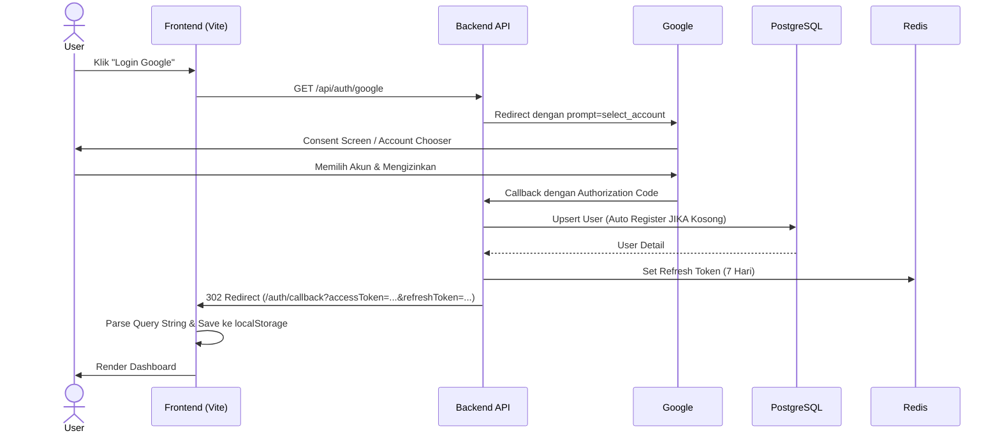

# PRD — Kolektaku Authentication System (Frontend)

**Version:** 1.1 · **Date:** 2026-03-08 · **Status:** Ready for Frontend Implementation

---

## 1. Overview

Kolektaku menggunakan sistem autentikasi stateless berbasis JWT. Sign-in utama menggunakan **Google OAuth**, sedangkan login berbasis email/password disediakan khusus untuk kebutuhan _development internal_.

Ketika user login menggunakan Google untuk pertama kalinya dan belum terdaftar di database, sistem berjenjang **auto-register** (membuat akun baru dengan role default) tanpa campur tangan pengguna.

---

## 2. Platform Requirements

### Functional Requirements

|  ID  | Requirement                                                                                               |
| :--: | :-------------------------------------------------------------------------------------------------------- |
| F-01 | User dapat login melalui akun Google                                                                      |
| F-02 | Auto-registration: Akun otomatis dibuat saat Google login pertama kali                                    |
| F-03 | Account Linking: Akun local existing dapat di-link ketika login menggunakan Google dengan email yang sama |
| F-04 | Access token dikelola dan disimpan sepenuhnya di `localStorage` frontend                                  |
| F-05 | Refresh token dikelola di Redis pada backend (tidak diekspos secara permanen ke frontend session)         |
| F-06 | Frontend harus melakukan **Token Rotation** menggunakan refresh token saat access token expired           |
| F-07 | Logout bersifat **Aplikasi Saja (App-Only)**: Tidak me-logout session Google di browser                   |
| F-08 | Endpoint `GET /api/auth/me` digunakan untuk menarik sesi user yang aktif via token JWT                    |
| F-09 | Menampilkan paksa "Account Chooser" saat login ulang via opsi `prompt: 'select_account'` di backend       |

### Non-Functional Requirements

|  ID   | Requirement                                                                                 |
| :---: | :------------------------------------------------------------------------------------------ |
| NF-01 | **Access Token TTL**: 15 menit                                                              |
| NF-02 | **Refresh Token TTL**: 7 hari                                                               |
| NF-03 | Semua endpoint API yang membutuhkan auth menggunakan header `Authorization: Bearer <token>` |
| NF-04 | User baru yang masuk lewat OAuth langsung mendapat hak akses "Non-Member" (`role_id = 3`)   |

---

## 3. Core Features Implementation

### 3.1 Google OAuth Login + Auto-Register

1. Frontend me-redirect user ke `GET /api/auth/google`.
2. Backend (via Passport.js) menangani flow ke consent screen.
3. Backend menerima profile (id, email, name, avatarUrl).
4. **Logic Backend**:
   - Jika belum terdaftar: Auto-create user dengan profile lengkap beserta avatar URL (`provider = google`).
   - Jika terdaftar lokal: Update OAuth ID dan Avatar URL-nya jika belum ada.
5. Backend set Refresh Token di Redis.
6. Backend memanggil `res.redirect()` ke frontend Callback URL, menyisipkan `accessToken` dan [refreshToken](file:///D:/Codingan/Kerjaan/Kolektaku/backend/src/service/authService.js#35-44) sebagai URL Query Params.

### 3.2 Token Management di Frontend

```javascript
// Access Token untuk request Header
accessToken  → localStorage.getItem("accessToken");

// Digunakan ketika request mendapat intercept 401 Unauthorized
refreshToken → localStorage.getItem("refreshToken");
```

### 3.3 Spesifikasi Logout

Karena skema token Stateless (JWT):

- **JANGAN** me-logout user dari Endpoint URL Google `accounts.google.com/Logout`.
- Logout hanya difokuskan pada pemusnahan validitas sesi internal Kolektaku:
  1. Frontend request `POST /api/auth/logout`.
  2. Backend menghapus refresh token di Redis secara spesifik.
  3. Frontend menghapus item JWT di tabel `localStorage`.

---

## 4. User Flow

### 4.1 Flow Login Google

```
User navigasi ke Login Page
  → Klik "Lanjutkan dengan Google"
  → Redirect ke GET /api/auth/google
  → (Google Auth Screen / Account Chooser dari prompt: select_account)
  → Auth berhasil → Redirect ke Callback Backend
  → Backend logic (DB Upsert & generate JWT)
  → Redirect ke Frontend Callback: /auth/callback?accessToken=X&refreshToken=Y
  → Frontend parse parameter URL
  → Simpan token di localStorage
  → Redirect ke Homepage (/)
```

### 4.2 Flow Auto-Refresh Token

```
Frontend melakukan HTTP Request (fetch/axios) menggunakan Access Token
  → Response 401 Unauthorized (expired: true)
  → Interceptor menangkap response
  → Pause/suspend request original yang gagal
  → Request POST /api/auth/refresh dengan body { refreshToken }
  → Response 200 { accessToken, refreshToken }
  → Update localStorage dengan pasang token baru
  → Lanjutkan/retry request original yang tertunda dengan bearer token baru
```

### 4.3 Flow Logout (App-Only)

```
User navigasi menu -> Klik Logout
  → Frontend request POST /api/auth/logout dengan bearertoken valid
  → Backend mendelete instance key Redis: refresh_token:<userId>
  → Request Berhasil (HTTP 200)
  → Frontend membersihkan localStorage
  → Frontend redirect browser logic ke /login
```

---

## 5. Technical Architecture & Schemas

### Sequence Diagram — Google OAuth Login



### Constraints & Standards

| Parameter                 | Ketentuan                                                              |
| :------------------------ | :--------------------------------------------------------------------- |
| **Kerahasiaan State**     | JWT Payload format: `{ id, email, roleId }` (Tidak ada sensitive data) |
| **Port Frontend Default** | `http://localhost:5173`                                                |
| **Enkripsi Sandi**        | Bcrypt (Rounds: 12) _Dev Local Access Only_                            |
| **Storage Refresh Token** | Upstash Redis                                                          |

### Role Hierarchy

1. **Admin (`id 1`)** - Full CMS capability.
2. **Member (`id 2`)** - Akun Subscribed / Plan Premium.
3. **User (`id 3`)** - Un-registered Default Status, Free Tier content.

### Database Reference (Core Auth Schema)

Tabel Prisma (`users`):

```prisma
model User {
  id        String       @id @default(uuid(7)) @db.Uuid
  email     String       @unique
  name      String?
  roleId    Int?         @map("role_id")
  password  String?
  oauthId   String?      @map("oauth_id")
  avatarUrl String?      @map("avatar_url") @db.Text  // URL Photo / Avatar profile
  provider  ProviderType @default(local) // enum: local, google
  metadata  Json?

  // Relations
  role         Role?             @relation(fields: [roleId], references: [id])
}
```
